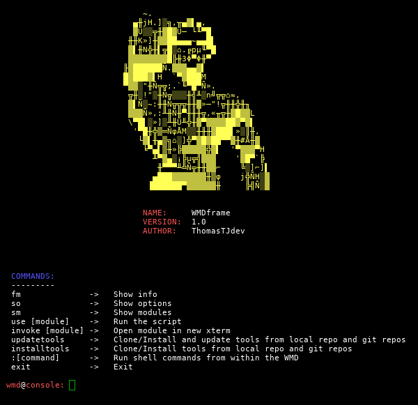
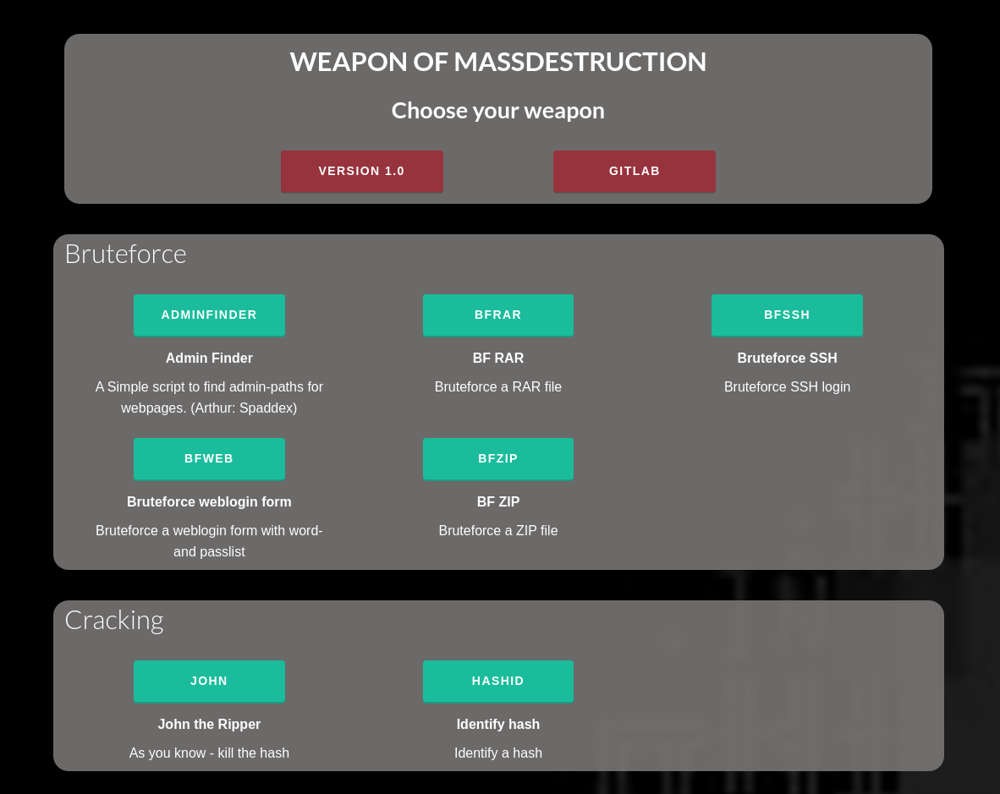

# WMD
## Weapon of Mass Destruction

This is a python tool with a collection of IT security software. The software is incapsulated in "modules". The modules does consist of pure python code and/or external third programs.

## Main functions

1) To use a module, run the command "use [module_call]", e.g. "use apsniff", to activate the module.  
2) The modules options can be changed with "set [parameter] [value]".  
3) Inside the modules, you always have the possibilty to view the options with the command "so".  
4)Your environment settings is in core/config.ini. Please adjust them before running.

**Screenshot:**  

## Web menu

Run the command "www" from the console to activate a Flask server showing the modules in your browser. Access it from: 127.0.0.1:5000.

Modules are loaded directly into a xterm.   
**DEV:** Try the SniffHTTP and APsniff module - define parameters in the browser.

**Screenshot:**  

## Modules
CAT:            | TYPE:        | CALL:           | NAME:                          | DESCRIPTION: 
----------------|--------------|-----------------|--------------------------------|----------------------------------------------
bruteforce      | creds        | changeme        | Default creds scan             | Scan IP's for services and try logging in with default credentials (Arthur: ztgrace)
bruteforce      | loginpath    | adminfinder     | Admin Finder                   | A Simple script to find admin-paths for webpages. (Arthur: Spaddex) 
bruteforce      | rar          | bfrar           | BF RAR                         | Bruteforce a RAR file 
bruteforce      | ssh          | bfssh           | Bruteforce SSH                 | Bruteforce SSH login 
bruteforce      | web          | bfweb           | Bruteforce weblogin form       | Bruteforce a weblogin form with word- and passlist 
bruteforce      | zip          | bfzip           | BF ZIP                         | Bruteforce a ZIP file 
cracking        | aut          | john            | John the Ripper                | As you know - kill the hash 
cracking        | hash         | hashid          | Identify hash                  | Identify a hash 
cracking        | wpa          | crackwpa        | Crack WPA 4-way handshake      | Gather WPA 4-way handshake from accesspoint and crack it 
exploit         | browser      | browserpwn      | Browser Autopwn2               | This module will automatically serve browser exploits (Arthur: sinn3r[at]metasploit.com) 
exploit         | search       | exploitdb       | Exploitdb                      | Shell-style script to search exploit-db.com exploits. (Arthur: mattoufoutu) 
mail            | sin          | mspoofcheck     | Spoofcheck email domain        | Check if a domain can be spoofed for e.g. emailing 
monitor         | arp          | arpmon          | ARP monitor alert              | Monitor ARP table and alert for changes 
monitor         | ip           | ipmon           | IP monitor alert               | Monitor IP's and alert for changes 
other           | settings     | settings        | Change settings                | Change your environment settings, e.g. interface 
pentesting      | niptt        | sparta          | SPARTA                         | SPARTA is a python GUI application which simplifies network infrastructure penetration testing.
phishing        | ap           | etphis          | Ewil Twin phishing             | Create a Evil Twin and redirect user to fake password page. 
phishing        | webpage      | webphis         | Webpage phishing               | Run a local flask server with phishing pages. 
recon           | dns          | dig             | Domain info groper             | Using dig command you can query DNS name servers for your DNS lookup related tasks 
recon           | dns          | dnsmap          | dnsmap                         | DNS Network Mapper. Enumeration and bruteforcing. 
recon           | dns          | dnsrecon        | dnsrecon                       | Multiple DNS recon abilities. 
router          | framework    | rsploit         | Routersploit                   | Framework for routers with exploits and getting creds. (Arthur: Reverse Shell Security) 
scan            | sin          | lanscan         | Lan scan                       | Scan local net - recon 
sniff           | aut          | apsniff         | AP sniff                       | Create AP and sniff HTTPS and avoid HSTS + Beef 
sniff           | http         | sniffhttp       | Sniff HTTP                     | Sniff HTTP packages. Extract username and passwords from traffic. 
sniff           | sin          | bettercap       | Bettercap                      | Bettercap integration for sniffing packets and bypass HSTS and HTTPS 
socialeng       | instagram    | instabot        | Instagram bot                  | Instagram bot for performing various activities (Arthur: LevPasha) 
spoof           | arp          | arpspoof        | ARP spoof                      | Spoofing ARP 
sql             | sqli         | gdsqli          | Gdork SQLi                     | Scrape net for urls and check if they are prone to SQL injection 
sql             | sqli         | sqlmap          | SQLmap                         | Just an activation of SQLmap.
system          | mac          | macc            | Macchanger                     | Change your MAC address 
tools           | search       | searchht        | Search hacktools               | Searchengine for hackingtools 
wifi            | accesspoint  | createap        | Create an Accesspoint          | Create an Accesspoint 
wifi            | wifi         | wifiutils       | WiFi utils                     | Utilities for WiFi, e.g. deauth, WiFi's, clients, probes, etc. 

## Run

_**Before your first run, please:**_
_1. Adjust your environment settings in `core/config.ini.default`_
_2. Rename `core/config.ini.default` to `core/config.ini`_

Start the console with:
`python3 wmd.py`

Start a single module:
`python3 wmd.py -m [CALL]`

Start webserver:
`python3 wmd.py -w`

Start without checking requirements:
`python3 wmd.py -nc`

## Requirements

_**Before your first run, please:**_
_1. Adjust your environment settings in `core/config.ini.default`_
_2. Rename `core/config.ini.default` to `core/config.ini`_

**Requirements:**  
* Linux operating system
* Python3
* Python libraries requirements in **requirements.txt**

**Optional tools/software/GIT:**   
_modules which needs them will inform you about it and just dont run.._
* GIT: Admin-Finder
* Aircrack-ng
* Airomon-ng
* Airodump-ng
* Airolib-ng
* Arp
* Arpspoof
* Beef
* Bettercap
* GIT: changeme
* CrackMapExec
* Create_ap
* Dig
* Dnsmap
* GIT: Dnsrecon
* GIT: Exploitdb
* GIT: Hashid
* Hostapd
* GIT: Instabot
* John the Ripper
* Nmap
* GIT: Routersploit
* SPARTA
* GIT: Spoofcheck
* GIT: XSSER

## Development
### Structure

* core --> The core files with functions used all over the code
* files --> Static files, passwordlist, etc.
* logs --> Standard folder for saving logs into
* modules --> Containing the modules
* tmp --> Guess
* tools --> GIT tools
* www --> Files for the webserver

#### New module

Checkout the template in `modules/module_template.py`

#### Add module

Run `python3 wmd.py -a modulePathName.py`

#### Pull requests

* Only python3 code
* Code needs to follow pep8 flake8 (no need for linebreak)

## Todo  
### First priority
* More modules
* ~~Interactive webinterface. Set settings and get results in the browser~~ <-- sniffhttp and apsniff done
* Rename config.ini to config.ini.default to avoid overriding userspecific config file

### Various  
* Proxychain
* Tor
* Threading on all BF
* Try/except on imports on modules for running with os.system
* Add run command with : in modules
* Add info about 'set para value' in modules (missing?!)
* Regenerate modules.xml (loop through modules)
* Design modules with core import and parser for design
* Check that there are enough credit to arthurs of tools, repos, etc.
* Split updatetools into local tools vs git
* When adding modules strip <> to ensuring XML format
* Change behavior of install and update tools
* Add invoke option inside all modules
* All modules - change options to Options
* Split files folder up into lists, etc
* Core network and wifi - merged?
* Original arthurs will be displayed below banner on modules. Todo.
* When showing modules indicate somehow what they require
* ~~Set modules parameters in browser dialog~~
* Add args to all modules and create dialog HTML (automated tool in development)

### core/tools.py
* Do a run through config.ini and extract names for the updatecommand instead of DRY in two functions

### Internal code
* cleanup getLocalIP (local_ip) in functions
* PEP8/Flake8 for old modules

### Modules
* ~~SQLmap~~
* ~~Sparta~~
* ~~http sniff pwd~~ <-- Done
* ~~Evil Twin~~ - deauth + info about unmanaging in NetworkManager
* ~~Evil Twin - arg parse for landingpage / + logfunction~~
* monitor network auto
* xsser
* target attack website or ip
* system information
* dns fake
* grep, sed, awk
* scapy on all network activity
* Admin finder - checkout google/bing search before BF
* Changeme - Ztgrace
* Osint frame
* Bettercap modules. Implementation in other modules. Excellent performance.
* Create Access Point with hostapd and dnsmasq. Already implemented in Ewil Twin
